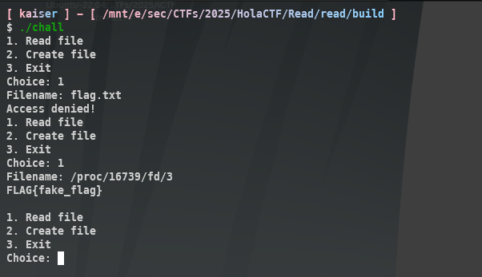

Chương trình cho phép đọc và tạo 1 flag tuỳ ý, điểm mấu chốt ở đây là khi nó read flag, nó lại read rồi mới `checkname`
nên là fd vẫn còn trong process, từ đó ta có thể đọc `/proc/pid/fd/<fd>` để có được flag
